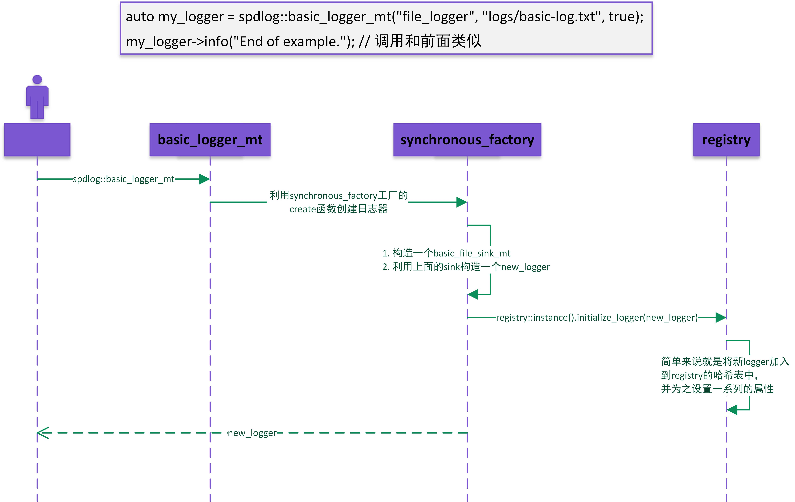

## 简介
这是一个[spdlog](https://github.com/gabime/spdlog)的简化版

1. 仅支持**linux**平台
2. 需要自行安装[fmt](https://github.com/fmtlib/fmt)
3. 少了很多类型的sink
4. 少了很多flag_formatter，且不支持填充对齐

秋招在即，想做几个项目充实充实简历，首先便将目光瞄准了网络库，但是由于缺乏经验，发现项目实在过于复杂，只是几个类就把我绕的有点晕。
所以在github上找了这个日志项目，作为学习之始。

## spdlog 概述

spdlog是一个基于C++11的日志库，支持同步和异步记录，可以自定义日志格式。

spdlog可以简单的分为几层：

1. 最上层是spdlog.h文件中的全局函数，通过这些全局函数可以使用spdlog的默认日志器打印日志，这些全局函数都是封装的`registry`类中的函数。
2. registry类是一个单例管理类，用于管理着多个日志器(logger)，通过registry可以对所有的日志器进行设置，比如将所有日志器的记录级别设置为info。
3. 一个日志器又可以有多个输出地点(sink)，不同的sink代表着将日志输出至不同的地点，例如终端、文件等。日志器有自己的输出级别，这个级别控制的是它里面的sink，所有日志必须大于这个级别才能进入sink，而sink中也有一个输出级别，日志只有大于这个级别才能最终的输出到文件中。

### 同步日志
当用户调用`spdlog::info("Welcome to spdlog!");`时，程序中的流程如下所示


### 创建日志器
用户创建日志器`auto my_logger = spdlog::basic_logger_mt("file_logger", "logs/basic-log.txt", true);`, 流程如下



### 异步日志
用户使用异步日志的流程图
```C++
auto async_file = spdlog::basic_logger_mt<spdlog::async_factory>("async_file_logger", "logs/async_log.txt");
async_file->info("Async message");
```


### 线程池
这里简单说一下spdlog后端日志的线程池

线程池包含两个成员
`q_`：这是一个`mpmc_blocking_queue`队列，它的底层是一个循环队列。可以将mpmc理解为一个多消费者多生产者的队列，生产者线程将日志放入这个队列中，然后消费者线程从队列中取出日志写入终端或文件。
`threads_`: 存放线程的`vector`容器。

线程池在构造函数中初始化n个线程，每个线程均执行一个"work loop", 这个"work loop"就是不停的从mpmc队列中取出日志，判断日志类型，如果是`log`，则写入日志，`flush`则刷新缓冲区，`terminate`则终止循环，此时线程也就结束了。
线程池在析构函数中向所有线程发送`terminate`类型的日志，并`join`它们